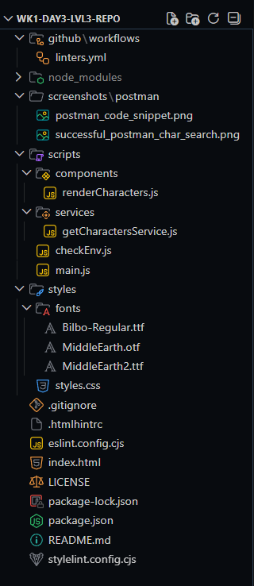
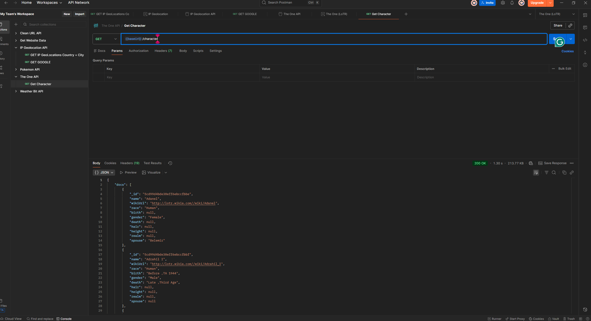
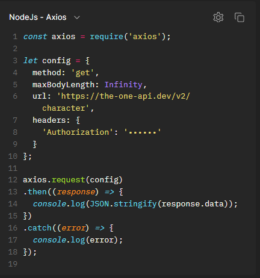
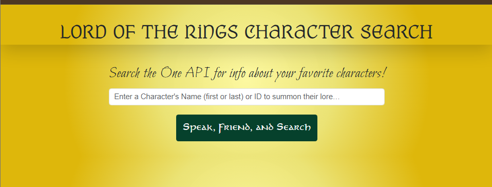

# wk1-day3-lvl3-repo

This is the repo for the Week 1, Day 3 assignment for Level 3 with CodeX where I’m pulling character info from The One API. This follows the same idea and structure as the Pokémon API assignment we did in Level 2, but now it’s all Middle-earth themed. I’ve added some custom fonts, a parchment-style gradient background, and card styling so the UI fits the theme better.

---

## Table of Contents

- [wk1-day3-lvl3-repo](#wk1-day3-lvl3-repo)
  - [Table of Contents](#table-of-contents)
  - [Project Structure](#project-structure)
  - [Postman Notes / API Prep](#postman-notes--api-prep)
  - [Setup (npm)](#setup-npm)
  - [How to Run](#how-to-run)
  - [API Token Setup](#api-token-setup)
  - [checkEnv.js](#checkenvjs)
  - [Linters and GitHub Workflow](#linters-and-github-workflow)
  - [Current UI](#current-ui)
  - [Screenshots](#screenshots)
    - [Postman](#postman)
  - [What’s Next](#whats-next)
  - [Resources](#resources)

## Project Structure

Keeping the layout consistent with what we’ve been doing in class:

## Postman Notes / API Prep

Before writing any JavaScript, I spent time testing The One API in Postman. These notes are from my working document.

* Signed up at[ https://the-one-api.dev](https://the-one-api.dev?utm_source=chatgpt.com)
* Got an access token
* Set the token in Postman under Auth as a Bearer Token
* Created a Postman environment with variables for the base URL and the token
* Tested the /character endpoint to see the structure of the data

Some things I noticed while testing:

* Some characters have duplicates (like multiple versions of Bilbo)
* Some characters don’t have a lot of info (only name, no height, hair, etc.)
* Depending on the name, I might get one result or several
* Postman showed the code snippet for the request, so I could see where the Bearer token goes in the axios headers

I also used this blog to understand the Bearer token a little better since it breaks everything down really simply:
[https://rike.dev/blog/rest-apis-for-absolute-beginners](https://rike.dev/blog/rest-apis-for-absolute-beginners)

---

## Setup (npm)

Every new project needs its own dependencies, even if we have used them before. After cloning the repo:

npm install

Then install the project dependencies:

npm install axios bootstrap lodash

And the dev tools:

npm install --save-dev live-server eslint stylelint stylelint-config-standard htmlhint

Lint config files and the GitHub workflow file are included, so linting runs on push.

---

## How to Run

In package.json, I added:

"scripts": {

"dev": "live-server --port=3000"

}

Then from the project root:

npm run dev

This starts the server and opens the app in the browser.

---

## API Token Setup

To actually fetch data later:

1. Log in at[ https://the-one-api.dev](https://the-one-api.dev?utm_source=chatgpt.com)
2. Copy your Bearer token
3. Go to scripts/services/getCharactersService.js
4. Paste the token into the constant at the top
5. Save

Axios uses the token inside the Authorization header like:

Authorization: Bearer `<your-token>`

That gets added in the request once the service file is written.

---

## checkEnv.js

Required for this week. This is the Node environment check script we wrote earlier. Run it like:

node scripts/services/checkEnv.js hello

It prints the Node version, current working directory, arguments, and system platform. This helps practice running JS in the terminal.

---

## Linters and GitHub Workflow

This project includes the full set of linters:

* ESLint for JavaScript
* Stylelint for CSS
* HTMLHint for HTML

The GitHub Actions workflow lives in:

.github/workflows/linters.yml

It runs all the linters on every push. I’ll add npm lint scripts later when more of the JS is written.

---

## Current UI

The UI now includes:

* Title using the MiddleEarth font
* Subheading in Bilbo font
* LOTR-themed button text
* LOTR placeholder text
* Updated background using a parchment-style radial gradient
* Styled cards using a parchment overlay + blur
* All fonts imported through `@font-face` inside `styles.css`

### Current CSS setup includes:

**Custom font imports:**

* MiddleEarth (title)
* Bilbo (body text)
* MiddleEarth2 (used on the button and cards as the “card” font)

**Gradient background (parchment gold):**

---

## Screenshots

### Project Structure

screenshot of the project structure in Vscode

### Postman

Successful Postman search with the-one-api after setting up the environment and collection.

screenshot of how the code snippet is set up for the fetch

### Final

screenshot of the page before search criteria is entered

---

## What’s Next

* Build the axios service to hit `/character`
* Add support for first/last/full-name matching
* Handle duplicate names gracefully
* Build render function for cards
* Connect everything in `main.js`
* Add npm lint scripts
* Add UI screenshots after everything works

---

## Resources

These are the main things I used while getting everything set up:

* The One API documentation
  [ https://the-one-api.dev/](https://the-one-api.dev/?utm_source=chatgpt.com)
* Beginner-friendly explanation of REST APIs (helped with understanding the Bearer token)
  [ https://rike.dev/blog/rest-apis-for-absolute-beginners](https://rike.dev/blog/rest-apis-for-absolute-beginners)
* Postman (used for all initial testing)
  [ https://www.postman.com/ ](https://www.postman.com/)
* CodeX Level 3 and Level 2 API examples (mainly the Pokémon API project structure)
* GitHub Actions documentation for workflows
  [ https://docs.github.com/en/actions](https://docs.github.com/en/actions)
* CSS Gradient Generator (used to build the background)
  [https://cssgradient.io/](https://cssgradient.io/)
* Bootstrap documentation (used for layout, spacing helpers, and form styling)
  [ https://getbootstrap.com/docs/](https://getbootstrap.com/docs)

**

